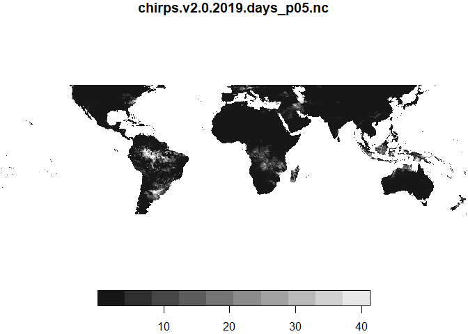
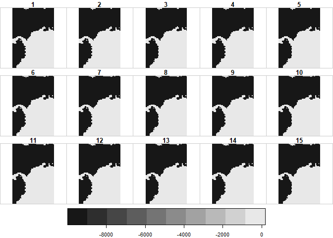
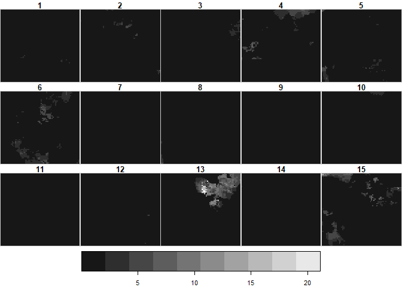
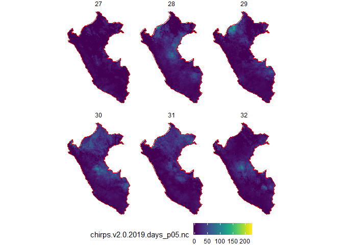
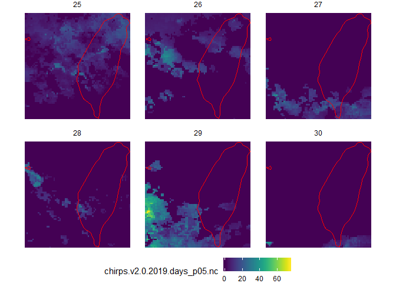

chirps-stars
================

*Exploration of CHIRPS data using R and the stars package for handling NetCDF files.*

CHIRPS data
-----------

"The Climate Hazards Group Infrared Precipitation with Station data (CHIRPS) is a high-resolution climatic database of precipitation embracing monthly precipitation climatology, quasi-global geostationary thermal infrared satellite observations from the Tropical Rainfall Measuring Mission (TRMM) 3B42 product, atmospheric model rainfall fields from National Oceanic and Atmospheric Administration – Climate Forecast System (NOAA CFS), and precipitation observations from various sources." (Retalis et al. 2017)

Overall it is a combination of station-base observations around the world, and satellite derived data for meteorology, including TRMM and NOAA, which are normally used for precipitation analysis.

The data covers information from 1981 to the present on a daily, monthly, yearly and decadal basis. It spans latitudes between 50°S and 50°N and all longitudes. The data is presented in a raster format with a cell siye of 0.05° or 0.25°. Each of the cells represent a rain gauge (Funk et al. 2015).

Data download
-------------

The global daily data which will be analyzed can be downloaded per year, either as a NetCDF file, where each band corresponds to a day; or daily as TIFF files. In this case I decided to work with NetCDF files and will explain how to explore the data using R and the `stars`package.

To explore initially the data, I will use the year 2019 at 0.05° resolution, which has information up to February. The updated data can be downloaded from this link (<ftp://ftp.chg.ucsb.edu/pub/org/chg/products/CHIRPS-2.0/global_daily/netcdf/p05/>)[1].

Manipulating the data in R
--------------------------

The focus of this data exploration is to use NetCDF files in R. This file format is meant for array oriented storage. It can have multiple dimesions and its applications span climatology, meteorology, oceanography, and general GIS data handling.

Packages such as `netcdf4` and `RNetCDF` are meant to handle such data in R. However, the new `stars` package is a promising approach to integrate NetCDF files with existing spatial packages for R, i.e. `sf`.

``` r
devtools::install_github('r-spatial/stars')
```

To load the data, `stars` makes use of its generic `read_stars` function which allows reading raster/array data. The function `read_ncdf` is also available and uses the netcdf package directly to load. ~~We load the data as a `stars_proxy` object which allows for faster manipulation of the data.~~ (There are some issues while projecting the data as a proxy and then cropping which I will try to report to the package developers.)

``` r
library(stars)
```

    ## Loading required package: abind

    ## Loading required package: sf

    ## Linking to GEOS 3.6.1, GDAL 2.2.3, PROJ 4.9.3

``` r
chirps19 <- read_stars('chirps-v2.0.2019.days_p05.nc', NA_value = -9999)
chirps19
```

    ## stars object with 3 dimensions and 1 attribute
    ## attribute(s), summary of first 1e+05 cells:
    ##  chirps-v2.0.2019.days_p05.nc 
    ##  Min.   : 0.00                
    ##  1st Qu.: 0.00                
    ##  Median : 1.43                
    ##  Mean   : 1.40                
    ##  3rd Qu.: 2.28                
    ##  Max.   :12.38                
    ##  NA's   :97816                
    ## dimension(s):
    ##      from   to offset delta refsys point values    
    ## x       1 7200     NA    NA     NA    NA   NULL [x]
    ## y       1 2000     NA    NA     NA    NA   NULL [y]
    ## band    1   59     NA    NA     NA    NA   NULL

Basic subsetting functions can be applied. For this, we can use the `tidyverse` functions by using the `dplyr` package. In the example below I take day 13 for a basic visualization. The pixel size is larger as we are loading the data as a proxy and visualization gets enhanced.

``` r
library(dplyr)
```

    ## 
    ## Attaching package: 'dplyr'

    ## The following objects are masked from 'package:stats':
    ## 
    ##     filter, lag

    ## The following objects are masked from 'package:base':
    ## 
    ##     intersect, setdiff, setequal, union

``` r
library(magrittr)
chirps19 %>% slice(band, 13) %T>% plot(breaks = 'equal')
```



    ## stars object with 2 dimensions and 1 attribute
    ## attribute(s), summary of first 1e+05 cells:
    ##  chirps.v2.0.2019.days_p05.nc 
    ##  Min.   : 0.00                
    ##  1st Qu.: 0.00                
    ##  Median : 0.00                
    ##  Mean   : 1.50                
    ##  3rd Qu.: 0.91                
    ##  Max.   :90.16                
    ##  NA's   :97816                
    ## dimension(s):
    ##   from   to offset delta refsys point values    
    ## x    1 7200     NA    NA     NA    NA   NULL [x]
    ## y    1 2000     NA    NA     NA    NA   NULL [y]

If we extract a smaller study area, the pixel size plots at a better scale. For this we can first take a look at the `rnaturalearth` packages.

``` r
library(rnaturalearth)
library(rnaturalearthdata)
world <- ne_countries(scale = 'medium', returnclass = 'sf')
taiwan <- world %>% filter(admin == 'Taiwan')
peru <- world %>% filter(admin == 'Peru')
```

The CRS should be the same for the clipping object and the precipitation data.

``` r
st_crs(world)
```

    ## Coordinate Reference System:
    ##   EPSG: 4326 
    ##   proj4string: "+proj=longlat +datum=WGS84 +no_defs"

However, there are some issues with the NetCDF file projection. The delta and offset values are not set. Hence, we will take them from the same data but on the TIFF version.

``` r
chirps_tif <- read_stars('chirps-v2.0.2019.02.28.tif', proxy = T)
chirps_tif
```

    ## stars_proxy object with 1 attribute in file:
    ## $`chirps-v2.0.2019.02.28.tif`
    ## [1] "chirps-v2.0.2019.02.28.tif"
    ## 
    ## dimension(s):
    ##   from   to offset delta                       refsys point values    
    ## x    1 7200   -180  0.05 +proj=longlat +datum=WGS8... FALSE   NULL [x]
    ## y    1 2000     50 -0.05 +proj=longlat +datum=WGS8... FALSE   NULL [y]

Now, although the offset and delta for `y` has a positive and negative value respectively, this does not create a good reference of the data, so I switched the signs to make it work better. Below, a quick function to make this process easier when applied to other parts.

``` r
st_set_chirps_dimensions <- function(x){
  x_def <- x %>% st_set_dimensions('x', offset = -180, delta = 0.05, refsys = "+proj=longlat +datum=WGS84 +no_defs")
  x_def <- x_def %>% st_set_dimensions('y', offset = -50, delta = 0.05, refsys = "+proj=longlat +datum=WGS84 +no_defs")
  x_def
}
```

``` r
chirps19_def <- chirps19 %>% st_set_chirps_dimensions()
```

Once we have this, we can save the data as an `stars` object and plot the data just for the study areas.

``` r
chirps19_peru <- chirps19_def[peru] 
```

    ## although coordinates are longitude/latitude, st_intersects assumes that they are planar

``` r
chirps19_taiwan <- chirps19_def[taiwan] 
```

    ## although coordinates are longitude/latitude, st_intersects assumes that they are planar

``` r
chirps19_peru[,,,1:15] %T>% plot(breaks = 'equal') 
```



    ## stars object with 3 dimensions and 1 attribute
    ## attribute(s), summary of first 1e+05 cells:
    ##  chirps.v2.0.2019.days_p05.nc 
    ##  Min.   : 0.00                
    ##  1st Qu.: 0.00                
    ##  Median : 0.00                
    ##  Mean   : 1.70                
    ##  3rd Qu.: 0.00                
    ##  Max.   :58.45                
    ##  NA's   :56629                
    ## dimension(s):
    ##      from   to offset delta                       refsys point values    
    ## x    1974 2227   -180  0.05 +proj=longlat +datum=WGS8...    NA   NULL [x]
    ## y     634 1000    -50  0.05 +proj=longlat +datum=WGS8...    NA   NULL [y]
    ## band    1   15     NA    NA                           NA    NA   NULL

``` r
chirps19_taiwan[,,,1:15] %T>% plot(breaks = 'equal') 
```



    ## stars object with 3 dimensions and 1 attribute
    ## attribute(s):
    ##  chirps.v2.0.2019.days_p05.nc 
    ##  Min.   : 0.00                
    ##  1st Qu.: 0.00                
    ##  Median : 0.00                
    ##  Mean   : 1.49                
    ##  3rd Qu.: 0.00                
    ##  Max.   :68.13                
    ##  NA's   :56430                
    ## dimension(s):
    ##      from   to offset delta                       refsys point values    
    ## x    5966 6039   -180  0.05 +proj=longlat +datum=WGS8...    NA   NULL [x]
    ## y    1439 1506    -50  0.05 +proj=longlat +datum=WGS8...    NA   NULL [y]
    ## band    1   15     NA    NA                           NA    NA   NULL

With this, we can do better plots by using the `ggplot2` package.

``` r
library(ggplot2)
library(viridis)
```

    ## Loading required package: viridisLite

``` r
ggplot() +
  geom_stars(data = chirps19_peru[,,,27:32]) +
  geom_sf(data = peru, fill = NA, color = 'red') +
  facet_wrap(~band) +
  scale_fill_viridis(na.value = 'white') +
  theme_void() +
  theme(
    legend.position = 'bottom',
    panel.grid.major = element_line(color = 'white')
  )
```



``` r
ggplot() +
  geom_stars(data = chirps19_taiwan[,,,25:30]) +
  geom_sf(data = taiwan, fill = NA, color = 'red') +
  facet_wrap(~band) +
  scale_fill_viridis(na.value = 'white') +
  theme_void() +
  theme(
    legend.position = 'bottom',
    panel.grid.major = element_line(color = 'white')
  )
```



Only a small subset of the 59 days available were taken for visualization. The data itself represents precipitation in mm/day.

References
==========

Funk, Chris, Pete Peterson, Martin Landsfeld, Diego Pedreros, James Verdin, Shraddhanand Shukla, Gregory Husak, et al. 2015. “The climate hazards infrared precipitation with stations—a new environmental record for monitoring extremes.” *Scientific Data* 2 (December). Nature Publishing Group: 150066. doi:[10.1038/sdata.2015.66](https://doi.org/10.1038/sdata.2015.66).

Retalis, Adrianos, Filippos Tymvios, Dimitrios Katsanos, and Silas Michaelides. 2017. “Downscaling CHIRPS precipitation data: an artificial neural network modelling approach.” *International Journal of Remote Sensing* 38 (13). Taylor & Francis: 3943–59. doi:[10.1080/01431161.2017.1312031](https://doi.org/10.1080/01431161.2017.1312031).

[1] ftp links not working in Markdown.
